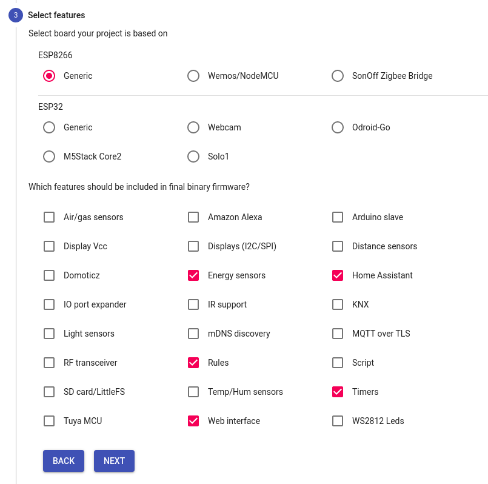
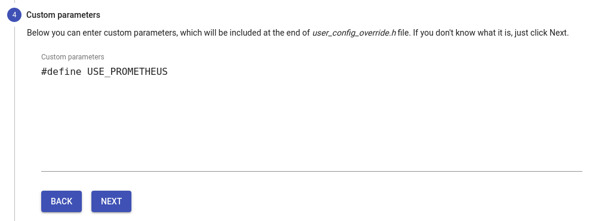

# delock-11827
Some informations around my delock-11827

## Build

<https://tasmota.github.io/docs/Compile-your-build/> recommended: TasmoCompiler


 * Generic ESP8266
 * Timers
 * Rules
 * Energy sensors
 * Home Assistant
 * Web Interface
 * Paramter: `#define USE_PROMETHEUS`






## Upgrade to latest tasmota

 * install the latest update from the Delock OTA server
 * do a `reset 3` and `reset 6` in the console
 * install the official version v7.2.0 from <http://ota.tasmota.com/tasmota/release-7.2.0/tasmota.bin>
 * install the official version v8.5.1 from <http://ota.tasmota.com/tasmota/release-8.5.1/tasmota.bin>
 * install the official version v9.1   from <http://ota.tasmota.com/tasmota/release-9.1.0/tasmota.bin>
 * install the custom firmware with prometheus: `v9.2.0/firmware.bin.gz`
 * install the custom firmware with prometheus: `v9.4.0/firmware.bin.gz`
 * install the custom firmware with prometheus & Home Assistant: `v9.5.0/firmware.bin.gz`


## Configuration:

Template:
```
{"NAME":"Delock 11827","GPIO":[0,0,0,17,133,132,0,0,131,158,21,0,0],"FLAG":0,"BASE":53}
```

WebUI Template
```
WebColor {"WebColor":["#eaeaea","#252525","#4f4f4f","#000000","#dddddd","#65c115","#1f1f1f","#ff5661","#008000","#faffff","#1fa3ec","#0e70a4","#d43535","#931f1f","#47c266","#5aaf6f","#faffff","#999999","#eaeaea"]}
```


## Know "issues"

Firmware upgrade from file fails with Upload buffer miscompare [#7560](https://github.com/arendst/Tasmota/issues/7560)

> If your firmware is big, you need to upload it gzipped or you need to upload minimal firmware first to free flash memory and then OTA the your full version.

## Resources

 * <https://templates.blakadder.com/delock_11827.html>
 * <https://jpmens.net/2020/11/22/delock-mqtt-enabled-power-socket-switches/>


